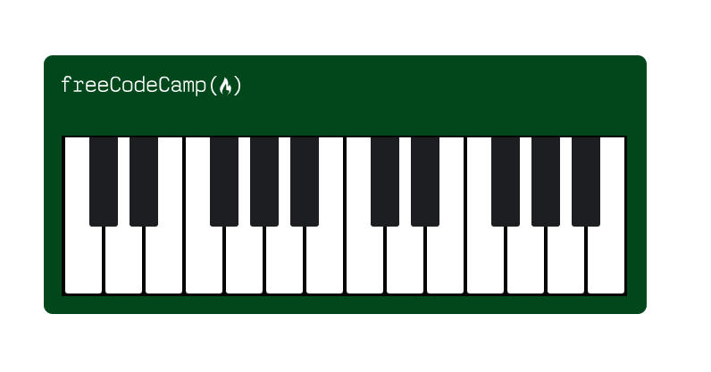

<h1 align="center"> Responsive Web Design Piano </h1>

 

  

## 🚀 Tecnologies

This project was developed with:

- HTML 
- CSS 

## 💻 Project

Responsive Design tells your webpage how it should look on different-sized screens.

---

No Copyright :wave: by https://www.freecodecamp.org

- [Access the finished project, online](https://rodrigocccesar.github.io/piano_code)

